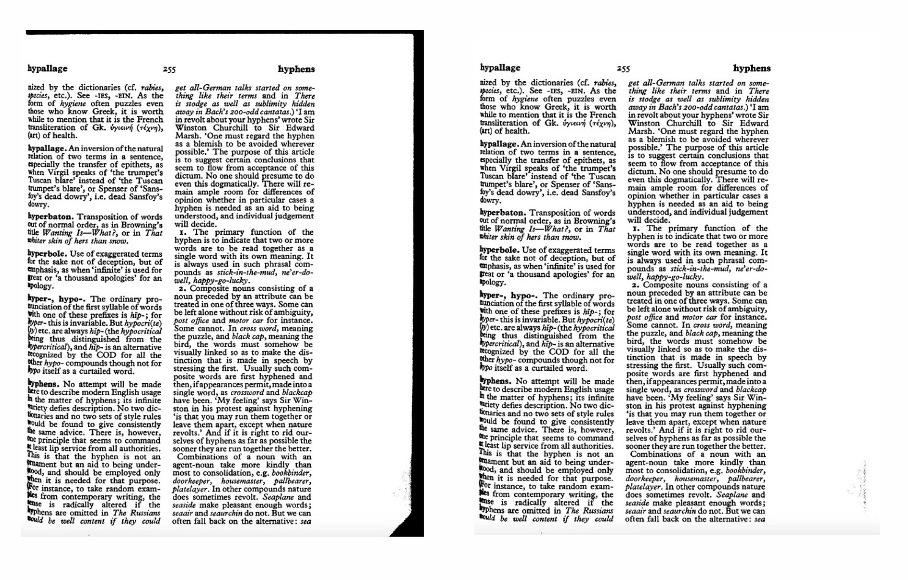

# unblack-edges
When making copies with a copy machine, it's very common for them to have dark, black lines along the edges due to misalignment in copying. Given a pbm image, *unblack-edges* removes these black edges from the image by mimicking the properties of a call stack. Written as an assignment for Tufts University's Machine Structures & Assembly-Language Programming Course in Spring 2020.

### Compile & Run
* Compile program using "make"
* Run with executable ./unblackedges \<PBM Image\>

### Purpose
*unblack-edges* removes black edges along the sides of a provided PBM image. When using a copy machine, it is very common for copies to return with dense, black lines along the missed edges. Rather than using the call stack to alter the black edge image bits, which can result in a stack overflow for large images, *unblack-edges* uses recursion and mimicks the pushing and popping properties of a computer's call stack on the heap. See end of *README.md* for image before and after processing by *unblack-edges*.

### Program Architecture
The program uses the included Bit2 module and [Hanson's](https://en.wikipedia.org/wiki/David_Hanson_(computer_scientist)) ADT Stack implementation. The Bit2 module represents a 2D bit structure of area width * height, represented as a one-dimensional bit vector of length width * height. The PBM image's bits are stored in an instance of Bit2. *unblack-edges* iterates through all the bits of each edge, unblacks black bits, and recursively adds black neighboring bits to a heap-allocated stack, mimicking the properties of the call stack.

### Files
* unblackedges.c: Drives the unblacking of a supplied PBM
* bit2.c: Bit2 module implementation, which represents a 2D bit structure (useful for images) of area width * height. Contains bit2 functions related to creating an instance of Bit2, freeing associated memory, getting/putting bits, and mapping.
* bit2.h: Bit2 module interface
* before.png: Example PBM image before processing through *unblack-edges*
* after.png: Example PBM image after processing through *unblack-edges*

### Example Before & After

